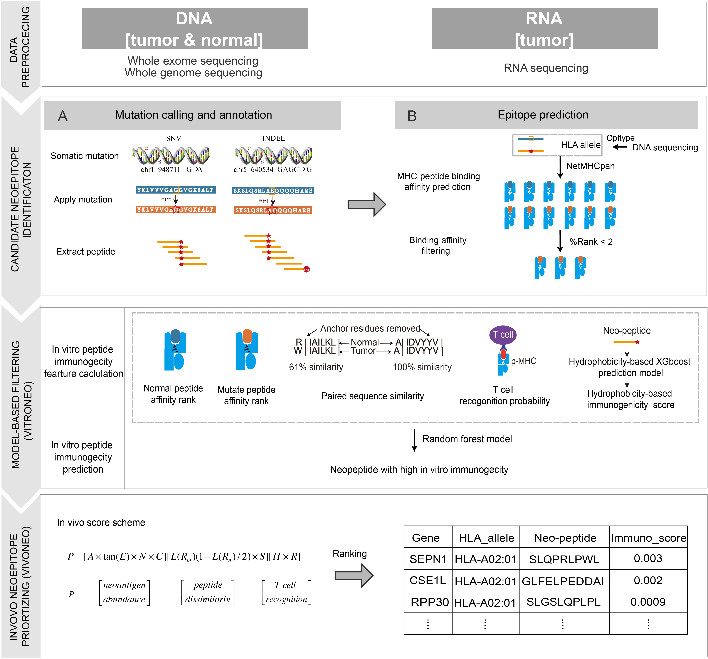

# ITUNES User Manual 


## Table of Contents
1. [General Description](#general-description)  
2. [Dependencies](#dependencies)  
    - [Required software](#required-software)  
    - [Python packages](#python-packages) 
3. [Installation via Docker](#installation-via-docker)  
4. [Installation from source](#installation-from-source)  
5. [Usage](#usage)  
6. [Input Files](#input-files)  
    - [Input Files (required)](#input-files (required))  
    - [Input Files (optional)](#input-files (optional))  
    - [References](#references)
    - [Training dataset](#training-dataset)
7. [Output Files](#output-files)  
    - [Column explanation](#column-explanation)  
8. [Test Example](#test-example)  
9. [Contact](#contact)
10. [Algorithmic Flow Chart](#algorithmic-flow-chart)

## General Description

Given matched tumor-normal whole exome sequencing and tumor RNA-seq sequencing data as input, iTuNes infers HLA sub-types, mutated peptides (neo-peptide), variant allele frequency, expression profile etc feature information. Based on these feature, a model- based refined ranking-score scheme could identify which of the neo-peptides have strong immunogecity.

## Dependencies  

#### Hardware:
iTuNEs currently test on x86_64 on ubuntu 16.04.

#### Required software:
* [Python 2.7](https://www.python.org/downloads/release/python-2712/)
* [R 3.2.3](https://cran.r-project.org/src/base/R-3/R-3.2.3.tar.gz)
* [NetMHCpan 4.0](http://www.cbs.dtu.dk/cgi-bin/nph-sw_request?netMHCpan)
* [Variant Effect Predictor (VEP)](https://github.com/Ensembl/ensembl-vep)
* [bwa](https://github.com/lh3/bwa)
* [samtools](https://github.com/samtools)
* [strelka](https://github.com/Illumina/strelka)
* [opitype](https://github.com/FRED-2/OptiType)
* [pyclone](https://bitbucket.org/aroth85/pyclone/wiki/Tutorial)
* [GATK 3.7](https://software.broadinstitute.org/gatk/best-practices/)
* [Picard tools](https://broadinstitute.github.io/picard/)
* [Java 8](https://java.com/en/download/help/linux_x64rpm_install.xml)
* [Varscan2](http://varscan.sourceforge.net/)
* [kallisto](http://pachterlab.github.io/kallisto/)
* [trimmomatic](http://www.usadellab.org/cms/?page=trimmomatic)
* [vcftools](http://vcftools.sourceforge.net/)
* [blast](http://ftp.ncbi.nlm.nih.gov/blast/executables/blast+/LATEST/)


#### Python modules:
    multiprocessing
    pyper
    yaml
    XGBoost
    Bio
    sklearn
    pandas
    numpy
   
## Installation via Docker
1. Install Docker on your computer and make sure it works.

2. Call docker `pull chizhou/itunes` which will download the Docker image.

3. You can use the image as followes:

    docker run -v /path/to/data/folder:/data/ -t chizhou/itunes -i config.yaml

## Installation from source

1. Install all software listed above. 
2. Install multiprocessing, pyper and sklearn with the following command:

        pip install multiprocessing
        pip install pyper
        pip install sklearn


3. Download or clone the iTuNEs repository to your local system:

        git clone https://github.com/XIAOCHIZI/iTuNES-dev.git

4. Reference data includes genome fasta, cDNA, peptide, cosmic reference(GRCh38 build) could be downloaded through:

        bash data_download.sh
        
    a few reference data would be in the fold `database`, including:

        [Genome reference]
        Homo_sapiens_assembly38.fasta
        dbsnp_138.hg38.vcf
        1000G_phase1.snps.high_confidence.hg38.vcf
        1000G_omni2.5.hg38.vcf
        Mills_and_1000G_gold_standard.indels.hg38.vcf
        CosmicCodingMuts_chr_M_sorted.vcf
        
        [EnsemblVEP]
        homo_sapiens_vep_89_GRCh38.tar.gz
        
        [cDNA and protein]
        Homo_sapiens.GRCh38.cdna.all.fa
        Homo_sapiens.GRCh38.pep.all.fa
    Moreover,the Catalogue of Somatic Mutations In Cancer (COSMIC) provides a variant file (VCF) of all coding mutations in 
    COSMIC. This VCF file is called CosmicCodingMuts.vcf.gz and can be found under the "Download" tab on the COSMIC website 
    (click the "VCF files" dropdown menu after loading the Download tab). You will need to register before gaining access to 
    the file. Note: to our knowledge COSMIC uses b38 which does not contain the 'chr' before the chromosome names like the 
    UCSC hg38. Thus, we provide scripts to convert the file into the correct format.
    1. Click [here](https://cancer.sanger.ac.uk/cosmic/register) to register
    2. Wait for the verification email (can take more than 24 hours) and follow instructions to create an account
    3. After you are registered, login to [COSMIC](https://cancer.sanger.ac.uk/cosmic/login)
    4. Click the "Download" tab
    5. Click the "VCF files" dropdown menu
    6. Click the "CosmicCodingMuts.vcf.gz" file name ([direct link] (https://cancer.sanger.ac.uk/files/cosmic/current_release/VCF/CosmicCodingMuts.vcf.gz))
    7. After you have downloaded the file, you will need to decompress it: `gunzip CosmicCodingMuts.vcf.gz`
    8. we need to convert it to be compatible to Mutect2 using the script  `cosmic_process.sh`
    
    The usage statement from `cosmic_process.sh`:
```
    cosmic_process.sh: A tool to format the COSMIC VCF file compatible for Mutect2
 	Usage: bash cosmic_process.sh <-i CosmicCodingMuts.vcf> <-o FormattedCosmicMuts.vcf> <-d Homo_sapiens_assembly38.dic>
	-i  Input CosmicCodingMuts.vcf file as downloaded from COSMIC
	-o  Output formatted COSMIC VCF file
	-p  Your path to picard
	-d  Path to the GATK hg19 bundle's sequence dictionary file
```
   Run this on your downloaded file.


5. Fill in the `config.yaml` file with your local path, make sure you have installed all above software and have downloaded
reference data.You should be aware that the version of VEP library you use should match the references used (peptide and cDNA). E.g. in the example above is used version/release 89 of GRCh38.


## Usage

After installation iTuNES is called as follows.The user should  
The config file is specified using the `-c` option

    path/to/iTuNES.py -c path/to/config.yaml

a detailed explaination is in example `config.yaml` file, you should replace the path of required software and reference file in your system.

## Input Files
Pair-end matched tumor-normal whole exome sequencing file should be provied for basic neoantigens identification, expression
profile file or raw RNA sequnencing file is optional if you want to get expressed neoantigen.

### Input Files (required) 

iTuNES accepts pair-end matched tumor-normal whole exome sequencing as input,it could be in `.fastq.gz` or `.fastq` format 
You should specify the right path to the sequencing file in `config.yaml` like:

    #your path to first tumor fastq file
    tumor_fastq_path_first: /home/zhouchi/ncbi/dbGaP-14145/sra/SRR2770550_1.fastq.gz
    #your path to second tumor fastq file
    tumor_fastq_path_second: /home/zhouchi/ncbi/dbGaP-14145/sra/SRR2770550_2.fastq.gz
    #your path to first normal fastq file
    normal_fastq_path_first: /home/zhouchi/ncbi/dbGaP-14145/sra/SRR2669057_1.fastq.gz
    #your path to second normal fastq file
    normal_fastq_path_second: /home/zhouchi/ncbi/dbGaP-14145/sra/SRR2669057_2.fastq.gz

A full example of an expression file can be found in example fold.
### Input Files (optional) 

It is optional, but preferable, to provide RNA sequencing data for evaluating the expression level of neoantigens or you 
could provide expression file derived from killasto or other tools. The files should be tab separated and include Ensembl transcript ID (ENST) and mean expression(tpm).

    target_id	length	eff_length	est_counts	tpm
    ENST00000434970.2	9	3.5	0	0
    ENST00000448914.1	13	7.5	0	0
    ENST00000415118.1	8	2.5	0	0
    ENST00000631435.1	12	6.5	0	0
    ENST00000632684.1	12	6.5	0	0

A full example of an expression file can be found in example
[here](exmple/abundance.tsv).

### References 
The following references are required for iTuNES to run:
* Snp: These files are used in somatic variant calling process.

        [Genome reference]
        Homo_sapiens_assembly38.fasta
        dbsnp_138.hg38.vcf.gz
        hapmap_3.3.hg38.vcf.gz
        1000G_phase1.snps.high_confidence.hg38.vcf.gz
        1000G_omni2.5.hg38.vcf.gz
        Mills_and_1000G_gold_standard.indels.hg38.vcf.gz
        CosmicCodingMuts_chr_M_sorted.vcf.gz 
    
* Peptide and cDNA: The peptide reference is a FASTA file containing all peptides and all cDNA sequences of the human proteome.

        [cDNA and protein]
        Homo_sapiens.GRCh38.cdna.all.fa
        Homo_sapiens.GRCh38.pep.all.fa
        
* EnsemblVEP: VEP cache database.   

        [EnsemblVEP]
        homo_sapiens_vep_89_GRCh38.tar.gz

It should be emphasized that it is of very high importance that the references and VEP
match in release version (e.g. release-89).

* Cosmic consencus gene 
TSV file containing known cancer driver genes. The cancer gene census can be
downloaded from the [COSMIC](http://cancer.sanger.ac.uk/census) website.  

* Cosmic VCF file

The Catalogue of Somatic Mutations In Cancer (COSMIC) provides a variant file (VCF) of all coding mutations in COSMIC. This VCF file is called CosmicCodingMuts.vcf.gz and can be found under the "Download" tab on the COSMIC website (click the "VCF files" dropdown menu after loading the Download tab). You will need to register before gaining access to the file. Note: to our knowledge COSMIC uses b38 which does not contain the 'chr' before the chromosome names like the UCSC hg38. Thus, we provide scripts to convert the file into the correct format.


### Training dataset


## Output Files 
iTuNES output four result files contains information of identified neoantigens corresponding to nonsynonymous point mutation and INDEL mutation.

The output files are the following: 
1.  snv.model.tsv 

    The file is a TSV file with the extracted mutated peptides derived from nonsynonymous point mutation with a model-based
    score measures the immunity of neoantigens in in-vivo experiment such as `ELISPOT` and `ICS`. 
    
2.  indel.model.tsv

    The file is a TSV file with the extracted mutated peptides derived from INDEL mutation with a model-based score measures
    the immunity of neoantigens in in-vivo experiment such as `ELISPOT` and `ICS`.
    
3.  snv.score.tsv

    The file is a TSV file with the extracted mutated peptides derived from nonsynonymous point mutation with a priority
    score measures the in-vitro immunogecity of neoantigens.
    
4.  indel.score.tsv

    The file is a TSV file with the extracted mutated peptides derived from INDEL mutation with a priority score
    measures the in-vitro immunogecity of neoantigens.


### Column explanation

The prediction output (.snv.model.tsv) for each peptide pair consists of the following columns:

| Column Name           | Description |
| -----------           | ----------- |
| Position              | Mutation position in genome. |
| HLA_type              | HLA allele name. |
| Gene                  | HUGO symbol name of mutatied gene. |
| WT_pep                | The extracted normal peptide. |
| WT_Binding_EL         | %Rank of prediction score for nomal peptides use NetMHCpan4.0(defalut model). |
| WT_Binding_Rank       | %Rank of prediction score for nomal peptides use NetMHCpan4.0(-ba model). |
| MT_pep                | The extracted mutant peptide. |
| MT_Binding_EL         | %Rank of prediction score for mutated peptides use NetMHCpan4.0(defalut model). |
| MT_Binding_Rank       | %Rank of prediction score for mutant peptides use NetMHCpan4.0(-ba model). |
| Transcript_name       | Ensembl transcript ID |
| Mutation              | necleatide change of mutated gene |
| AA_change             | Amino acid change annotated in VEP file. |
| Variant_allele_frequency  | Genomic allele frequency detected by MuTect2. |
| DriverGene_Lable      | TRUE if the HUGO symbol is in the cosmic reference list, FALSE if it is not. |
| MT_Binding_level_des  | Binding level description of mutated peptide. |
| WT_Binding_level_des  | Binding level description of normal peptide. |
| Homolog_pep           | The extracted homologous peptide of neo-peptide in human protein. |
| Homolog_Binding_EL    | %Rank of prediction score for homologous peptides use NetMHCpan4.0(defalut model).|
| Recognition_score     | T cell recognition score calculated based on TCR cross reactivity. |
| Hydrophobicity_score  | Neo-peptide immunity mesurement based on animo acid hydrophobicity. |
| Self_sequence_similarity | Sequence similarity bewteen mutated peptide and normal(homglogous) peptide, We select the bigger one as final score |
| model_pro       | Model prediction score denpend on Recognition_score, Hydrophobicity_score, Self_sequence_similarity, WT_Binding_EL, MT_Binding_EL . |

## Test example 

To run the provided test files with iTuNES the following command can be run: 

        path/to/iTuNES.py -i config.yaml

## Contact   
 
1410782Chiz@tongji.edu.cn or qiliu@tongji.edu.cn

Biological and Medical Big data Mining Lab  
Tongji University    

## Algorithmic Flow Chart


